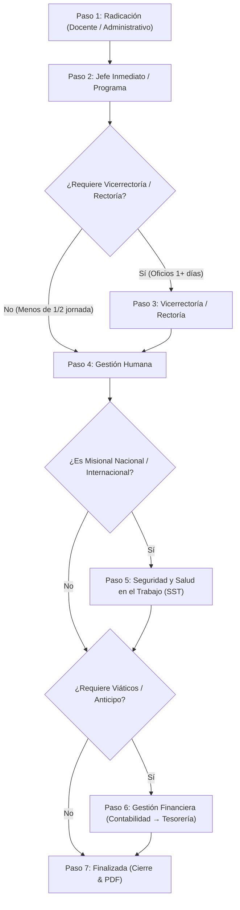

# Guía Maestra de Flujos y Reglas Institucionales - Reporte de Salida y Viáticos (SIAC)

Este documento contiene la especificación completa, **paso a paso**, de todos los flujos de trabajo, tipologías de salida, reglas de notificación, asignación de autoridades y validaciones del módulo **Reporte de Salida (THM-DP-FR-002)** y su integración con **Desplazamiento y Viáticos**.

---

## 🗺️ 1. Mapa General del Flujo Secuencial



---

## 📌 2. Paso a Paso Detallado por Tipología de Salida

---

### 🔹 Flujo A: Salida Académica / Misional de Docentes (Oficios 1, 2 o 3+ Días)

#### 🔄 Secuencia de Pasos
`[Paso 1: Radicación Docente]` $\rightarrow$ `[Paso 2: Visto Bueno Jefe / Programa]` $\rightarrow$ `[Paso 3: Vicerrectoría Académica]` $\rightarrow$ `[Paso 4: Talento Humano]` $\rightarrow$ `[Paso 5: SST (si aplica)]` $\rightarrow$ `[Paso 6: Viáticos (si aplica)]` $\rightarrow$ `[Paso 7: Finalizada]`

#### 📊 Transición de Estados
`borrador` $\rightarrow$ `pendiente_aprobacion_jefe` $\rightarrow$ `pendiente_aprobacion_vicerrectoria_academica` $\rightarrow$ `pendiente_aprobacion_gestion_humana` $\rightarrow$ `pendiente_aprobacion_sst` $\rightarrow$ `pendiente_viaticos` $\rightarrow$ `finalizada`

#### 📋 Detalle de Ejecución Paso a Paso:
1. **Paso 1 - Radicación:** El docente diligencia y radica la solicitud.
   - **Arquitectura:** Notificación enviada **únicamente** a `arquitectura@unicesmag.edu.co` *(salvo auto-permisos)*.
   - **Diseño Gráfico:** Notificación enviada **únicamente** a `disenografico@unicesmag.edu.co` *(salvo auto-permisos)*.
   - **Otros Programas (Ed. Infantil, Derecho, Sistemas, Psicología, etc.):** Notificación enviada a **ambos** simultáneamente (`correo_programa` + `correo_jefe_inmediato`).
2. **Paso 2 - Visto Bueno de Jefe Inmediato / Dirección:** El Jefe/Programa aprueba la solicitud. El estado cambia a `pendiente_aprobacion_vicerrectoria_academica`.
3. **Paso 3 - Vicerrectoría Académica:** La Vicerrectoría Académica (`viceacad@unicesmag.edu.co`) revisa y aprueba.
   - *Regla Anti-Duplicidad:* Si la Vicerrectora (Dra. Sandra Bolaños) aprobó en el Paso 2 como jefa directa, se omite el Paso 3 automáticamente. El estado avanza a `pendiente_aprobacion_gestion_humana`.
4. **Paso 4 - Talento Humano:** Gestión Humana valida aspectos de vinculación y reposición (si aplica). El estado avanza a `pendiente_aprobacion_sst` (o salta a viáticos/finalizada).
5. **Paso 5 - SST (Seguridad y Salud en el Trabajo):** Si el alcance es Nacional o Internacional, SST aprueba las coberturas ARL. El estado avanza a `pendiente_viaticos` o `finalizada`.
6. **Paso 6 - Viáticos / Gestión Financiera (Si aplica):** Técnico Contable liquida gastos y Tesorería realiza el desembolso.
7. **Paso 7 - Finalizada (Cierre):** El trámite concluye. Se emite el PDF firmado y se notifica al docente, al programa y a la Vicerrectoría Académica.

---

### 🔹 Flujo B: Salida Administrativa Misional (1, 2 o 3+ Días)

#### 🔄 Secuencia de Pasos
`[Paso 1: Radicación Administrativo]` $\rightarrow$ `[Paso 2: Visto Bueno Jefe Inmediato]` $\rightarrow$ `[Paso 3: Vicerrectoría / Rectoría Correspondiente]` $\rightarrow$ `[Paso 4: Talento Humano]` $\rightarrow$ `[Paso 5: SST (si aplica)]` $\rightarrow$ `[Paso 6: Viáticos (si aplica)]` $\rightarrow$ `[Paso 7: Finalizada]`

#### 📊 Transición de Estados
`borrador` $\rightarrow$ `pendiente_aprobacion_jefe` $\rightarrow$ `pendiente_aprobacion_vicerrectoria` $\rightarrow$ `pendiente_aprobacion_gestion_humana` $\rightarrow$ `pendiente_aprobacion_sst` $\rightarrow$ `pendiente_viaticos` $\rightarrow$ `finalizada`

#### 📋 Detalle de Ejecución Paso a Paso:
1. **Paso 1 - Radicación:** El colaborador administrativo efectúa la solicitud en la plataforma.
2. **Paso 2 - Jefe Inmediato:** El jefe directo recibe el correo con botones de aprobación y autoriza.
3. **Paso 3 - Instancia Superior por Dependencia:**
   - **Vicerrectoría Financiera:** Remite a `viceadfin@unicesmag.edu.co` / `jcnandar@unicesmag.edu.co`.
   - **Vicerrectoría de Investigación:** Remite exclusivamente a `jajimenez@unicesmag.edu.co`.
   - **Vicerrectoría para la Evangelización:** Remite a `vicebien@unicesmag.edu.co`.
   - **Rectoría:** Adscritos al Rector o de 3+ días a `rectoria@unicesmag.edu.co`.
4. **Paso 4 - Talento Humano:** Revisión administrativa de permisos y licencias.
5. **Paso 5 - SST:** Validación de riesgos laborales para salidas fuera de sede.
6. **Paso 6 - Viáticos:** Liquidación y giro de anticipos.
7. **Paso 7 - Finalizada:** Expedición de paz y salvo del viaje y generación de PDF consolidado.

---

### 🔹 Flujo C: Salidas Cortas (Menos de Media Jornada)

#### 🔄 Secuencia de Pasos
`[Paso 1: Radicación]` $\rightarrow$ `[Paso 2: Visto Bueno Jefe Inmediato]` $\rightarrow$ `[Paso 3: Talento Humano]` $\rightarrow$ `[Paso 4: Finalizada]`

#### 📊 Transición de Estados
`borrador` $\rightarrow$ `pendiente_aprobacion_jefe` $\rightarrow$ `pendiente_aprobacion_gestion_humana` $\rightarrow$ `finalizada`

#### 📋 Detalle de Ejecución Paso a Paso:
1. **Paso 1 - Radicación:** Se solicita salida corta por diligencias menores o permisos por horas.
2. **Paso 2 - Jefe Inmediato:** El jefe directo autoriza la ausencia temporal.
3. **Paso 3 - Salto de Vicerrectoría:** Debido a la corta duración (< 1/2 jornada), la solicitud **omite el paso de Vicerrectoría** y pasa directo a `pendiente_aprobacion_gestion_humana`.
4. **Paso 4 - Finalizada:** Gestión Humana aprueba y el estado se marca como `finalizada`.

---

### 🔹 Flujo D: Permisos Personales con Reposición de Tiempo (Diligencia Personal)

#### 🔄 Secuencia de Pasos
`[Paso 1: Radicación y Cálculo Minutos]` $\rightarrow$ `[Paso 2: Visto Bueno Jefe Inmediato]` $\rightarrow$ `[Paso 3: Talento Humano]` $\rightarrow$ `[Paso 4: Módulo de Reposición]` $\rightarrow$ `[Paso 5: Finalizada]`

#### 📊 Transición de Estados
`borrador` $\rightarrow$ `pendiente_aprobacion_jefe` $\rightarrow$ `pendiente_aprobacion_gestion_humana` $\rightarrow$ `finalizada` *(con plan de reposición activo)*

#### 📋 Detalle de Ejecución Paso a Paso:
1. **Paso 1 - Radicación:** El docente o administrativo especifica las horas a ausentarse. El sistema calcula la equivalencia según jornada laboral (8h40m para TC, o proporcional para MT y Hora Cátedra).
2. **Paso 2 - Jefe Inmediato:** El jefe valida la justificación y autoriza la reposición acordada.
3. **Paso 3 - Talento Humano:** Gestión Humana verifica el balance de horas e inscribe la obligación de reposición.
4. **Paso 4 - Módulo de Reposición (Seguimiento Continuo):**
   - Estado del compromiso: `pendiente` $\rightarrow$ `programada` (al agendar fechas) $\rightarrow$ `cumplida` (al validar horas ejecutadas).
5. **Paso 5 - Finalizada:** Trámite formal cerrado en sistema.

---

### 🔹 Flujo E: Salidas de Proyección Social / Extensión

#### 🔄 Secuencia de Pasos
`[Paso 1: Radicación Docente/Colaborador]` $\rightarrow$ `[Paso 2: Visto Bueno Jefe Inmediato]` $\rightarrow$ `[Paso 3: Coordinación de Proyección Social (con botones de aprobación)]` $\rightarrow$ `[Paso 4: Vicerrectoría Académica / Instancia Superior]` $\rightarrow$ `[Paso 5: Talento Humano]` $\rightarrow$ `[Paso 6: SST / Viáticos (si aplica)]` $\rightarrow$ `[Paso 7: Finalizada]`

#### 📊 Transición de Estados
`borrador` $\rightarrow$ `pendiente_aprobacion_jefe` $\rightarrow$ `pendiente_aprobacion_proyeccion_social` $\rightarrow$ `pendiente_aprobacion_vicerrectoria_academica` $\rightarrow$ `pendiente_aprobacion_gestion_humana` $\rightarrow$ `pendiente_aprobacion_sst` $\rightarrow$ `pendiente_viaticos` $\rightarrow$ `finalizada`

#### 📋 Detalle de Ejecución Paso a Paso:
1. **Paso 1 - Radicación:** El docente/líder registra una salida de campo con comunidad o proyecto social. El correo inicial de aprobación se envía únicamente al **Jefe Inmediato** asignado.
2. **Paso 2 - Visto Bueno Jefe Inmediato:** El Jefe Inmediato aprueba desde el correo o el panel. El estado cambia a `pendiente_aprobacion_proyeccion_social`.
3. **Paso 3 - Coordinación de Proyección Social y Extensión:** La Coordinación de Proyección Social (`proyeccion.social@unicesmag.edu.co`) recibe la notificación con sus botones de acción (**AUTORIZAR PROYECCIÓN SOCIAL** / **NO AUTORIZAR**) y aprueba el trámite.
4. **Paso 4 - Vicerrectoría / Instancia Superior:** Si es docente de 1+ días, pasa a Vicerrectoría Académica (`viceacad@unicesmag.edu.co`). Si es corta (< 1/2 jornada), salta a Talento Humano.
5. **Paso 5 - Talento Humano:** Verificación institucional de vinculación.
6. **Paso 6 - SST / Viáticos:** Revisión de coberturas ARL y asignación de presupuesto/gastos de viaje (si aplica).
7. **Paso 7 - Finalizada:** Expedición final del reporte de salida y PDF firmado con copias a Proyección Social y Vicerrectoría.

---

## 👥 3. Ejemplos Concretos de Trazabilidad por Usuario, Dependencia y Jerarquía (Jefe de Jefes)

| # | Perfil del Solicitante | Ejemplo / Contexto | Paso 1: Notificación Radicación | Paso 2: Aprobación Jefe Inmediato | Paso 3: Aprobación Jefe de Jefes (Vicerrectoría / Rectoría) | Pasos Finales (Talento Humano ➔ SST ➔ Viáticos ➔ Cierre) |
|---|---|---|---|---|---|---|
| **1** | **Docente Programa Regular** | Docente Licenciatura en Ed. Infantil | `edupres@unicesmag.edu.co` **+** `smgaleano@unicesmag.edu.co` | Stella Maris Galeano (Directora de Programa) | Vicerrectoría Académica (`viceacad@unicesmag.edu.co`) | Talento Humano $\rightarrow$ SST $\rightarrow$ Viáticos $\rightarrow$ Finalizada *(Copia a Docente + Programa + Vicerrectoría)* |
| **2** | **Docente Programa Especial (Arquitectura)** | Docente de Arquitectura | `arquitectura@unicesmag.edu.co` *(Exclusivo, sin correo personal del jefe)* | Bandeja oficial de Arquitectura | Vicerrectoría Académica (`viceacad@unicesmag.edu.co`) | Talento Humano $\rightarrow$ SST $\rightarrow$ Viáticos $\rightarrow$ Finalizada *(Copia a Docente + Programa + Vicerrectoría)* |
| **3** | **Docente Programa Especial (Diseño Gráfico)** | Docente de Diseño Gráfico | `disenografico@unicesmag.edu.co` *(Exclusivo, sin correo personal del jefe)* | Bandeja oficial de Diseño Gráfico | Vicerrectoría Académica (`viceacad@unicesmag.edu.co`) | Talento Humano $\rightarrow$ SST $\rightarrow$ Viáticos $\rightarrow$ Finalizada *(Copia a Docente + Programa + Vicerrectoría)* |
| **4** | **Directora / Líder de Programa (Auto-solicitud)** | Magaly Martínez (Arquitectura) / Karen Ocaña (Diseño) | Auto-permiso detectado. Pasa directo a Instancia Superior. | Vicerrectora Académica / Decano (Jefe de Jefes) | Vicerrectoría Académica *(Skip anti-duplicidad por auto-aprobación superior)* | Talento Humano $\rightarrow$ SST $\rightarrow$ Viáticos $\rightarrow$ Finalizada |
| **5** | **Colaborador Vicerrectoría de Investigación** | Investigador / Profesional de Proyecto | `jajimenez@unicesmag.edu.co` **+** Dependencia | Jefe Inmediato de Grupo de Investigación | Javier Jiménez (Vicerrector de Investigación - `jajimenez@unicesmag.edu.co`) | Talento Humano $\rightarrow$ SST $\rightarrow$ Viáticos $\rightarrow$ Finalizada *(Copia a Solicitante + Vicerrectoría)* |
| **6** | **Colaborador Vicerrectoría Financiera** | Auxiliar / Profesional Contable | `viceadfin@unicesmag.edu.co` **+** Dependencia | Jefe Inmediato del Área Financiera | Juan Carlos Nandar (Vicerrector Financiero - `viceadfin@unicesmag.edu.co`) | Talento Humano $\rightarrow$ SST $\rightarrow$ Viáticos $\rightarrow$ Finalizada *(Copia a Solicitante + Vicerrectoría)* |
| **7** | **Colaborador Vicerrectoría de Evangelización** | Coordinador / Profesional Bienestar | `vicebien@unicesmag.edu.co` **+** Dependencia | Jefe Inmediato Pastoral / Bienestar | María del Pilar (Vicerrectora de Evangelización - `vicebien@unicesmag.edu.co`) | Talento Humano $\rightarrow$ SST $\rightarrow$ Viáticos $\rightarrow$ Finalizada *(Copia a Solicitante + Vicerrectoría)* |
| **8** | **Decano / Vicerrector / Adscrito a Rectoría** | Decano de Facultad / Vicerrector(a) | `rectoria@unicesmag.edu.co` | Rector / Secretaría General (Jefe Supremo) | Rectoría (`rectoria@unicesmag.edu.co`) | Talento Humano $\rightarrow$ SST $\rightarrow$ Viáticos $\rightarrow$ Finalizada *(Copia a Solicitante + Rectoría)* |
| **9** | **Solicitud de Proyección Social / Extensión** | Docente / Líder con salida de Proyección Social | `correo_jefe_inmediato` *(Únicamente a Jefe Inmediato al radicar)* | Jefe Inmediato | Coordinación de Proyección Social (`proyeccion.social@unicesmag.edu.co` con botones) $\rightarrow$ Vicerrectoría Académica | Talento Humano $\rightarrow$ SST $\rightarrow$ Viáticos $\rightarrow$ Finalizada *(Copia a Solicitante + Proyección Social + Vicerrectoría)* |

---

## 📧 4. Matriz de Destinatarios y Envíos por Programa / Dependencia

| Programa / Dependencia | Paso 1 (Radicación) | Paso 3 (Vicerrectoría / Superior) | Copia Final (Cierre) |
| :--- | :--- | :--- | :--- |
| **Programa de Arquitectura** | `arquitectura@unicesmag.edu.co` *(Exclusivo)* | `viceacad@unicesmag.edu.co` | Solicitante + Programa + Vicerrectoría |
| **Programa de Diseño Gráfico** | `disenografico@unicesmag.edu.co` *(Exclusivo)* | `viceacad@unicesmag.edu.co` | Solicitante + Programa + Vicerrectoría |
| **Ed. Infantil, Derecho, Sistemas, etc.** | `correo_programa` **+** `correo_jefe` | `viceacad@unicesmag.edu.co` | Solicitante + Programa + Vicerrectoría |
| **Vicerrectoría de Investigación** | `dependencia_email` **+** `jajimenez@unicesmag.edu.co` | `jajimenez@unicesmag.edu.co` | Solicitante + Vicerrectoría |
| **Vicerrectoría Financiera** | `dependencia_email` **+** `viceadfin@unicesmag.edu.co` | `viceadfin@unicesmag.edu.co` | Solicitante + Vicerrectoría |
| **Vicerrectoría para la Evangelización** | `dependencia_email` **+** `vicebien@unicesmag.edu.co` | `vicebien@unicesmag.edu.co` | Solicitante + Vicerrectoría |
| **Rectoría / Secretaría General** | `rectoria@unicesmag.edu.co` | `rectoria@unicesmag.edu.co` | Solicitante + Rectoría |

---

## ⚙️ 5. Reglas Técnicas y Protecciones del Código

1. **Aprobación Administrativa por Etapas:**
   - La función `editarSolicitudAdmin` en `reporteSalidaController.js` procesa las aprobaciones del Administrador respetando el orden secuencial del flujo.
   - El botón de aprobación del frontend en `ReporteSalidaSeguimiento.js` **nunca** fuerza `estado: 'finalizada'`.
2. **Filtro por Estado Canónico:**
   - El selector del frontend utiliza `STATUS_FILTER_OPTIONS` con etiquetas únicas sin duplicados.
   - El backend utiliza `getEstadoWhereCondition` (`Op.in`) para incluir alias de estados equivalentes.
3. **Importación de Módulos:**
   - Se requiere `const { sequelize } = require('../config/database');` en `reporteSalidaController.js` para asegurar que las operaciones sobre salidas grupales (`grupo_id`) ejecuten sin lanzar `ReferenceError`.

---

## 🧪 6. Verificación de Regresión

Antes de desplegar cualquier actualización, ejecutar la suite nativa de pruebas:
```bash
node --test backend/src/services/reporteSalidaWorkflow/reposicionAcademicaAccess.test.js
```
La suite debe ejecutarse y pasar al 100%. No fijar aquí una cantidad de pruebas, porque debe crecer con cada regla de regresión incorporada.

---

## 7. Ajustes protegidos y reglas de no regresión

Las siguientes reglas son obligatorias. Cualquier agente que modifique Reportes de Salida debe preservarlas, agregar pruebas para los cambios y comprobar que no altera los demás flujos.

### 7.1 Aprobaciones asignadas a Sandra Bolaños

1. Si `jefe_snapshot` identifica a **SANDRA LUCIA BOLAÑOS DELGADO**, ya sea por nombre, por `sbolanos@unicesmag.edu.co` o por `viceacad@unicesmag.edu.co`, la aprobación se envía **exclusivamente** a:
   - `viceacad@unicesmag.edu.co`
2. `sbolanos@unicesmag.edu.co` nunca debe incluirse como destinatario personal de estas solicitudes de aprobación.
3. Esta regla tiene prioridad sobre las reglas generales de programa, departamento o dependencia.
4. Aplica a radicaciones individuales y grupales.
5. No modificar esta excepción al ajustar los flujos de Arquitectura, Diseño Gráfico u otros programas académicos.
6. La lógica canónica se encuentra en `isSandraAcademicBoss` y `getInitialApprovalRecipientEmails`, dentro de `backend/src/controllers/reporteSalidaController.js`.

### 7.2 Correo mostrado debajo de Jefe inmediato

1. La tabla de seguimiento debe mostrar debajo del nombre del jefe el correo que **realmente recibe la solicitud de aprobación**.
2. El backend debe exponer ese valor como `jefe.email_aprobacion` al serializar la solicitud.
3. `jefe.email` se conserva como dato histórico del perfil y no debe usarse como primera opción visual cuando exista `email_aprobacion`.
4. Para Sandra Bolaños, la interfaz debe mostrar `viceacad@unicesmag.edu.co`, nunca `sbolanos@unicesmag.edu.co`.

### 7.3 Nombre de la Vicerrectoría en el estado

1. El estado `pendiente_aprobacion_vicerrectoria_academica` es una clave técnica compartida; su etiqueta visible no debe quedar como el texto genérico "Pendiente Vicerrectoría".
2. La interfaz debe tomar `datos_formulario.laboral.vicerrectoria` y mostrar el nombre correspondiente, por ejemplo:
   - `Pendiente Vicerrectoría Académica`.
   - `Pendiente Vicerrectoría de Investigación y Extensión`.
   - `Pendiente Vicerrectoría Financiera y de Desarrollo Institucional`.
3. Mantener el mismo nombre específico en las exportaciones a Excel.
4. La función visual canónica es `getStatusLabel` en `frontend/src/components/reporteSalida/ReporteSalidaSeguimiento.js`.

### 7.4 Detalle/Motivo y "Otra, ¿cuál?" sin recortes

1. `salida.motivo` es un campo narrativo libre para **todas** las categorías y subtipos: salud, trámites personales, diligencia personal, compensatorios, actividades propias del cargo, salidas misionales, proyección social, salidas individuales, grupales y cualquier tipo futuro. No establecer `maxLength` en el formulario ni recortarlo con `slice`, `substring` o `sanitizeText(..., limite)` al guardarlo.
2. El valor personalizado de `salida.tipo` con prefijo `otra:` tampoco debe limitarse a 60 caracteres ni a otro máximo artificial.
3. `substring(5)` solo se permite para retirar el prefijo técnico `otra:`; nunca para truncar la descripción.
4. Usar `sanitizeFreeText` para conservar el texto completo y sus saltos de línea, eliminando únicamente caracteres nulos.
5. El PDF FR-002 debe imprimir todo el contenido de `Detalle/Motivo`. Si no cabe en una página, debe continuar en las páginas siguientes.
6. Las firmas, la trazabilidad y el bloque de verificación deben fluir después del texto; nunca superponerse ni provocar su recorte.
7. Los registros antiguos que ya fueron truncados no pueden reconstruirse automáticamente. La garantía aplica a nuevas radicaciones o textos que vuelvan a guardarse desde su fuente original.
8. La misma garantía aplica al `objetoComision` del flujo de desplazamiento con viáticos y a `oficioCuerpo` cuando incorpora el motivo. Los PDF FR-002, los oficios de salida y los formatos de desplazamiento/viáticos deben conservar y mostrar el texto completo.

### 7.5 Disciplina obligatoria al modificar el módulo

1. Antes de editar, revisar esta guía completa y el diff pendiente del repositorio.
2. Limitar cada cambio al flujo solicitado. No modificar aprobadores, destinatarios, estados, reposición, SST, Gestión Humana o viáticos si la solicitud no lo requiere expresamente.
3. No sustituir reglas específicas por generalizaciones que cambien destinatarios institucionales.
4. Ejecutar como mínimo:

```bash
node backend/src/services/reporteSalidaWorkflow/reposicionAcademicaAccess.test.js
cd frontend && npm run build
```

5. Deben permanecer cubiertos por pruebas, como mínimo:
   - Sandra como jefe en solicitud individual: solo `viceacad@unicesmag.edu.co`.
   - Sandra como jefe en solicitud grupal: solo `viceacad@unicesmag.edu.co`.
   - La cuenta personal de Sandra no administra la bandeja institucional de reposiciones.
   - Los textos narrativos mayores de 600 caracteres se conservan completos y mantienen saltos de línea.
   - Arquitectura, Diseño Gráfico, Financiera, Investigación, Evangelización, Rectoría, SST, Gestión Humana, reposiciones y viáticos conservan sus flujos existentes.
6. Si una prueba ajena al cambio falla, no ocultarla ni eliminarla: corregir la regresión antes de entregar.
